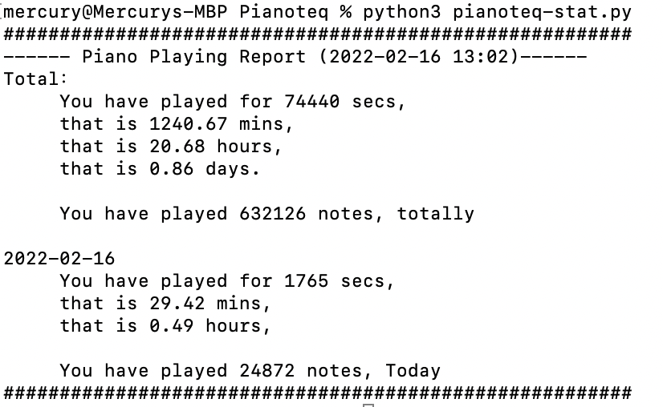

#Pianoteq-Stat
For those of you who practices piano by Pianoteq. This script will generate report showing you how you are using Pianoteq.

## You will know:
* How long you have played **today**, or any **given day**, or **life-time**.
* How many note you have played **today**, or any **given day**, or **life-time**.

## Screenshot

## Getting Started
You may need intro-level Python skill to use the script.

### Before Installing
`pianoteq-stat` generate report by a built-in function in Pianoteq called `MIDI Archiver`. The function records all the notes you 
played into MIDI files. To use `pianoteq-stat`, the function `MIDI Archiver` must be enabled.

### Installing
1. Download `pianoteq-stat.py`.  
2. Move `pianoteq-stat.py` to the same dictionary as `Pianoteq MIDI Archiver`.
> The default dictionary of `Pianoteq MIDI Archiver` on MacOS is `~/Library/Application Support/Modartt/Pianoteq/HowLong.py`
3. Make sure that your `Pianoteq MIDI Archiver` is enabled.
4. I suggest you set the `retention period of archived MIDI recordings` to `A billion years`.
5. Open terminal and run the script

## Version
* 0.1 (2022-02-16)
  * Basic functions.

## Todo
- [ ] get stat by week
- [ ] an achievement system
- [ ] show the chord you are playing
- [ ] analysis the habit of your playing.
